# SNU Toto 테스트 시나리오

## 비표준 표기 설명

> 본 문서의 다이어그램은 Mermaid로 작성되어 UML 표준과 일부 다릅니다.

| 요소 | UML 표준 | 본 문서 표기 | 비고 |
|------|----------|-------------|------|
| Actor | 스틱맨 그림 | `["텍스트"]` 박스 | Mermaid 스틱맨 미지원 |
| Use Case | 타원형 | `(("텍스트"))` 원형 | Mermaid 타원 미지원 |
| Include/Extend | `<<include>>`, `<<extend>>` 스테레오타입 | 생략 | 단순화 |
| Sequence 메시지 번호 | 선택사항 (위→아래 순서로 암묵적) | 미사용 | 표준 준수 |

---

## 테스트 파일 구조

```
snu_toto/tests/
├── conftest.py          # 공통 픽스처
├── test_users.py        # 회원가입 단일 테스트
├── test_auth.py         # 로그인/인증 단일 테스트
├── test_events.py       # 이벤트 단일 테스트
├── test_bets.py         # 베팅 단일 테스트
├── test_settlement.py   # 정산 단일 테스트
└── test_integration.py  # 통합 테스트
```

---

## 0. Overview: Use Case Diagram

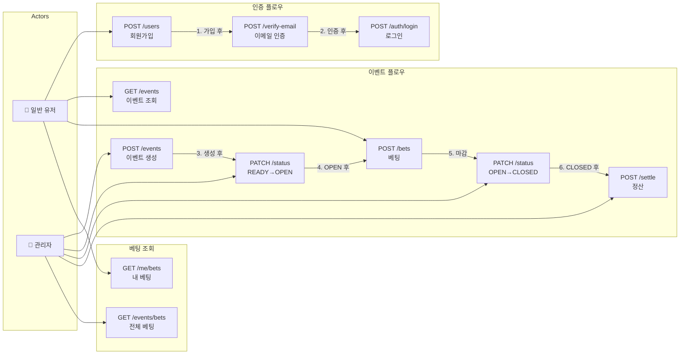
```mermaid
flowchart LR
    subgraph Actors["Actors"]
        User["👤 일반 유저"]
        Admin["🔧 관리자"]
    end

    subgraph AuthFlow["인증 플로우"]
        direction TB
        A1["POST /users<br/>회원가입"]
        A2["POST /verify-email<br/>이메일 인증"]
        A3["POST /auth/login<br/>로그인"]
        A1 -->|1. 가입 후| A2
        A2 -->|2. 인증 후| A3
    end

    subgraph EventFlow["이벤트 플로우"]
        direction TB
        E1["POST /events<br/>이벤트 생성"]
        E2["GET /events<br/>이벤트 조회"]
        E3["PATCH /status<br/>READY→OPEN"]
        E4["POST /bets<br/>베팅"]
        E5["PATCH /status<br/>OPEN→CLOSED"]
        E6["POST /settle<br/>정산"]
        E1 -->|3. 생성 후| E3
        E3 -->|4. OPEN 후| E4
        E4 -->|5. 마감| E5
        E5 -->|6. CLOSED 후| E6
    end

    subgraph BetQuery["베팅 조회"]
        B1["GET /me/bets<br/>내 베팅"]
        B2["GET /events/bets<br/>전체 베팅"]
    end

    User --> A1
    User --> E2
    User --> E4
    User --> B1
    Admin --> E1
    Admin --> E3
    Admin --> E5
    Admin --> E6
    Admin --> B2
```

---

## 1. 단일 테스트 (Unit Tests)

> **정의**: API 1개만 호출. Pydantic 필드 검증 제외.

### 1-1. 회원가입 (`test_users.py`)

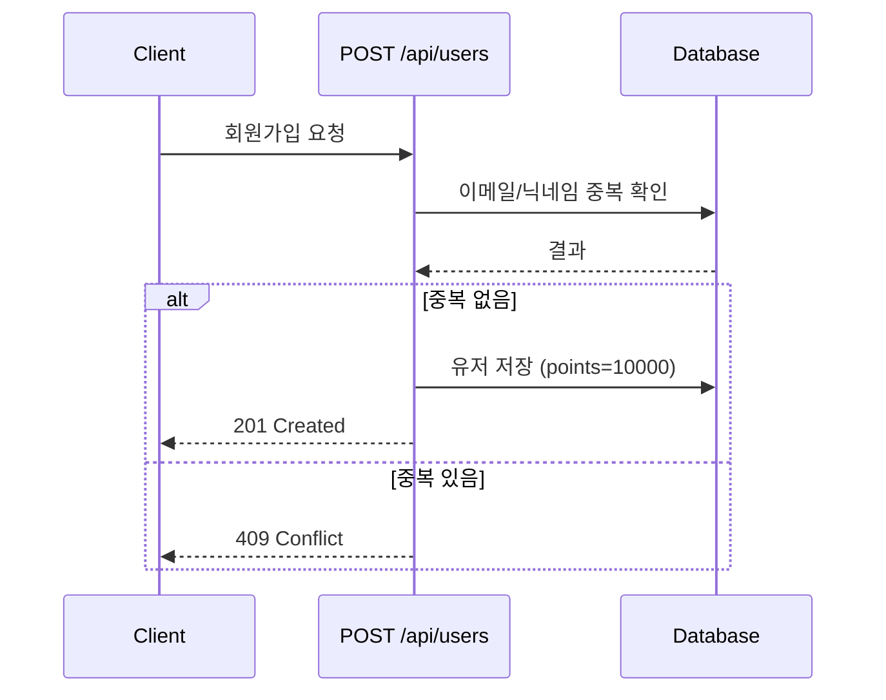
```mermaid
sequenceDiagram
    participant Client
    participant API as POST /api/users
    participant DB as Database

    Client->>API: 회원가입 요청
    API->>DB: 이메일/닉네임 중복 확인
    DB-->>API: 결과
    alt 중복 없음
        API->>DB: 유저 저장 (points=10000)
        API-->>Client: 201 Created
    else 중복 있음
        API-->>Client: 409 Conflict
    end
```

| ID | 시나리오 | API | 예상 결과 |
|----|----------|-----|-----------|
| U01 | 일반 회원가입 성공 | POST /api/users | 201, `points: 10000` |
| U02 | 소셜 회원가입 성공 | POST /api/users | 201, `social_type: "GOOGLE"` |
| U03 | SNU 이메일 아님 | POST /api/users | 403, `ERR_010` |
| U04 | 이메일 중복 | POST /api/users | 409, `ERR_006` |
| U05 | 닉네임 중복 | POST /api/users | 409, `ERR_007` |
| U06 | 소셜ID 중복 | POST /api/users | 409, `ERR_018` |
| U07 | LOCAL인데 password 누락 | POST /api/users | 400, `ERR_016` |
| U08 | SOCIAL인데 social_id 누락 | POST /api/users | 400, `ERR_017` |

---

### 1-2. 로그인 (`test_auth.py`)

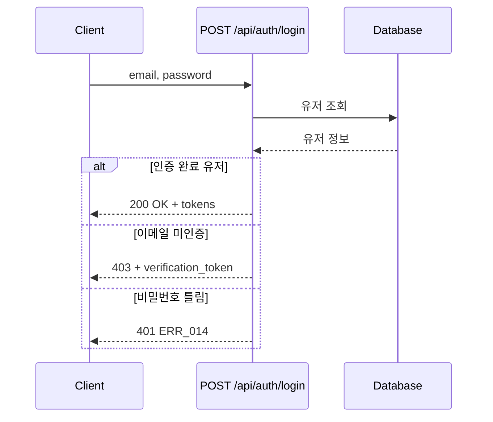
```mermaid
sequenceDiagram
    participant Client
    participant API as POST /api/auth/login
    participant DB as Database

    Client->>API: email, password
    API->>DB: 유저 조회
    DB-->>API: 유저 정보
    alt 인증 완료 유저
        API-->>Client: 200 OK + tokens
    else 이메일 미인증
        API-->>Client: 403 + verification_token
    else 비밀번호 틀림
        API-->>Client: 401 ERR_014
    end
```

| ID | 시나리오 | API | 예상 결과 |
|----|----------|-----|-----------|
| A01 | 로그인 성공 | POST /api/auth/login | 200, `access_token` |
| A02 | 이메일 미인증 | POST /api/auth/login | 403, `ERR_015` |
| A03 | 잘못된 비밀번호 | POST /api/auth/login | 401, `ERR_014` |
| A04 | 미가입 이메일 | POST /api/auth/login | 401, `ERR_014` |

---

### 1-2-1. 구글 OAuth (`test_auth.py`)

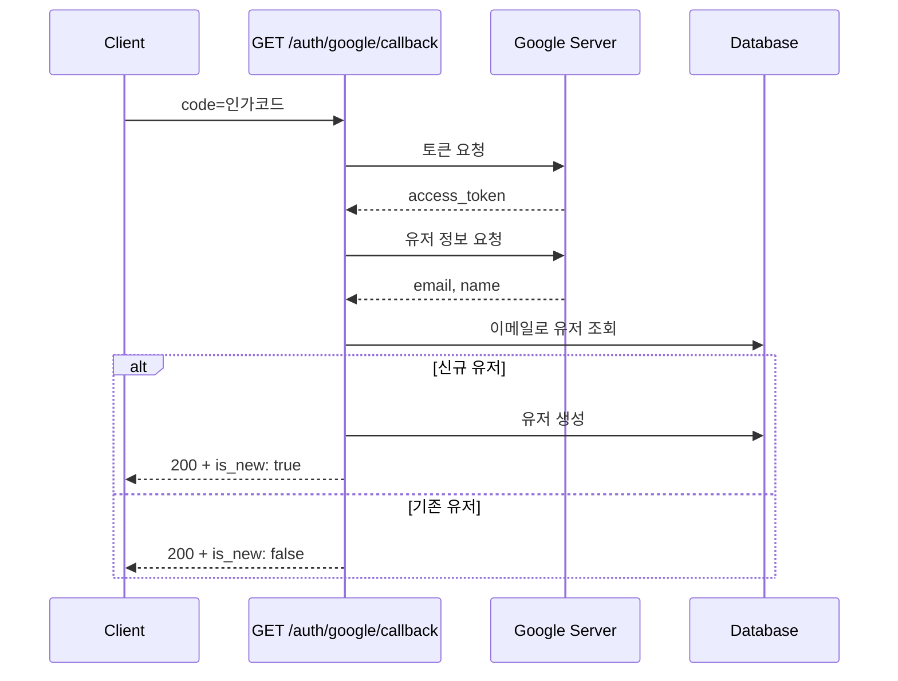
```mermaid
sequenceDiagram
    participant Client
    participant API as GET /auth/google/callback
    participant Google as Google Server
    participant DB as Database

    Client->>API: code=인가코드
    API->>Google: 토큰 요청
    Google-->>API: access_token
    API->>Google: 유저 정보 요청
    Google-->>API: email, name
    API->>DB: 이메일로 유저 조회
    alt 신규 유저
        API->>DB: 유저 생성
        API-->>Client: 200 + is_new: true
    else 기존 유저
        API-->>Client: 200 + is_new: false
    end
```

| ID | 시나리오 | API | 예상 결과 |
|----|----------|-----|-----------|
| A15 | 구글 콜백 성공 (신규 가입) | GET /api/auth/google/callback | 200, `is_new: true` |
| A16 | 구글 콜백 성공 (기존 유저) | GET /api/auth/google/callback | 200, `is_new: false` |
| A17 | 콜백 code 누락 | GET /api/auth/google/callback | 400, `ERR_020` |
| A18 | 구글 인증 실패 | GET /api/auth/google/callback | 400, `ERR_019` |

---

### 1-3. 인증코드 발송 (`test_auth.py`)

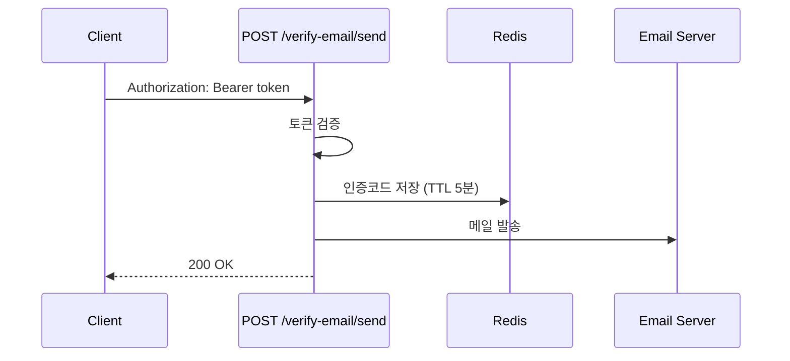
```mermaid
sequenceDiagram
    participant Client
    participant API as POST /verify-email/send
    participant Redis
    participant Email as Email Server

    Client->>API: Authorization: Bearer token
    API->>API: 토큰 검증
    API->>Redis: 인증코드 저장 (TTL 5분)
    API->>Email: 메일 발송
    API-->>Client: 200 OK
```

| ID | 시나리오 | API | 예상 결과 |
|----|----------|-----|-----------|
| A05 | 발송 성공 | POST /verify-email/send | 200 |
| A06 | 토큰 없음 | POST /verify-email/send | 401, `ERR_004` |
| A07 | 헤더 형식 오류 | POST /verify-email/send | 400, `ERR_003` |
| A08 | 만료된 토큰 | POST /verify-email/send | 401, `ERR_005` |
| A09 | 1분 내 재발송 | POST /verify-email/send | 429, `ERR_021` |
| A10 | 이미 인증 완료된 이메일 | POST /verify-email/send | 400, `ERR_011` |

---

### 1-4. 인증코드 확인 (`test_auth.py`)

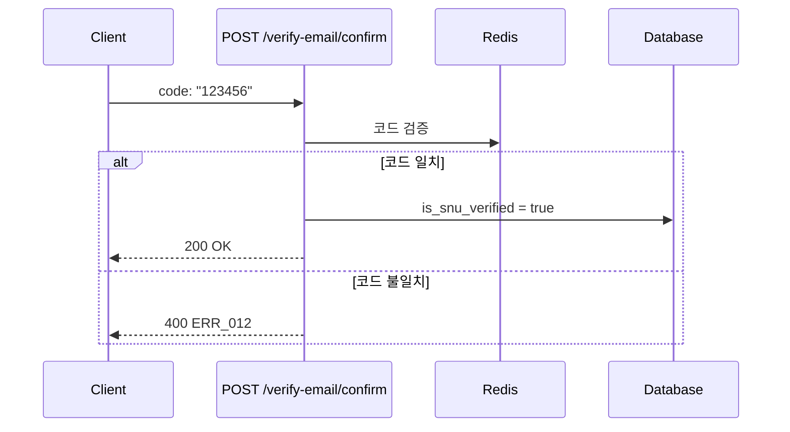
```mermaid
sequenceDiagram
    participant Client
    participant API as POST /verify-email/confirm
    participant Redis
    participant DB as Database

    Client->>API: code: "123456"
    API->>Redis: 코드 검증
    alt 코드 일치
        API->>DB: is_snu_verified = true
        API-->>Client: 200 OK
    else 코드 불일치
        API-->>Client: 400 ERR_012
    end
```

| ID | 시나리오 | API | 예상 결과 |
|----|----------|-----|-----------|
| A11 | 확인 성공 | POST /verify-email/confirm | 200 |
| A12 | 잘못된 코드 | POST /verify-email/confirm | 400, `ERR_012` |
| A13 | 헤더 형식 오류 | POST /verify-email/confirm | 400, `ERR_003` |
| A14 | 만료된 토큰 | POST /verify-email/confirm | 401, `ERR_005` |

---

### 1-5. 이벤트 생성 (`test_events.py`)

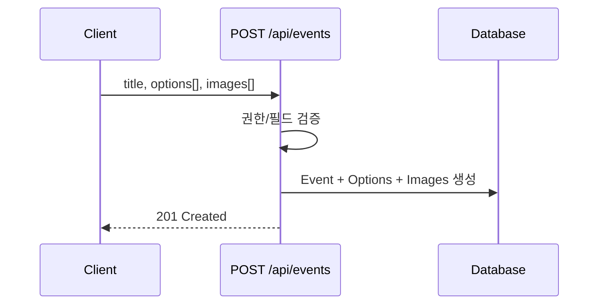
```mermaid
sequenceDiagram
    participant Client
    participant API as POST /api/events
    participant DB as Database

    Client->>API: title, options[], images[]
    API->>API: 권한/필드 검증
    API->>DB: Event + Options + Images 생성
    API-->>Client: 201 Created
```

| ID | 시나리오 | API | 예상 결과 |
|----|----------|-----|-----------|
| E01 | 생성 성공 | POST /api/events | 201, `status: "READY"` |
| E02 | 옵션 3개 포함 | POST /api/events | 201 |
| E03 | 중복 옵션 이름 | POST /api/events | 409, `ERR_028` |
| E04 | 토큰 없음 | POST /api/events | 401, `ERR_004` |
| E05 | 헤더 형식 오류 | POST /api/events | 400, `ERR_003` |
| E06 | 만료된 토큰 | POST /api/events | 401, `ERR_005` |
| E07 | 종료시각이 현재보다 과거 | POST /api/events | 400, `ERR_023` |
| E08 | 옵션 1개만 (2개 미만) | POST /api/events | 400, `ERR_024` |
| E09 | 옵션 11개 (10개 초과) | POST /api/events | 400, `ERR_024` |

---

### 1-6. 이벤트 조회 (`test_events.py`)

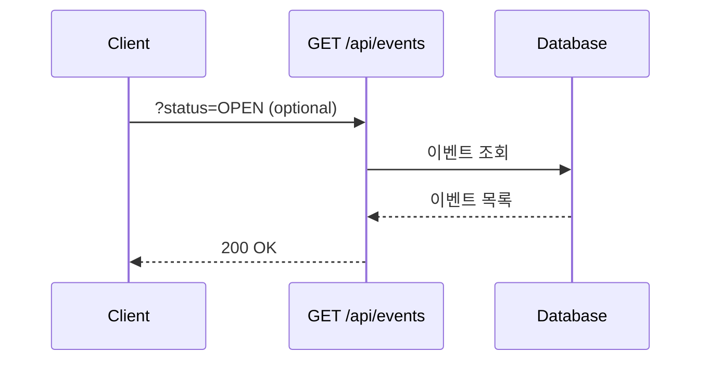
```mermaid
sequenceDiagram
    participant Client
    participant API as GET /api/events
    participant DB as Database

    Client->>API: ?status=OPEN (optional)
    API->>DB: 이벤트 조회
    DB-->>API: 이벤트 목록
    API-->>Client: 200 OK
```

| ID | 시나리오 | API | 예상 결과 |
|----|----------|-----|-----------|
| E16 | 목록 조회 | GET /api/events | 200 |
| E17 | 상태 필터 | GET /api/events?status=OPEN | 200 |
| E18 | 상세 조회 | GET /api/events/{id} | 200 |
| E19 | 없는 이벤트 | GET /api/events/{id} | 404, `ERR_009` |

---

### 1-7. 상태 변경 (`test_events.py`)

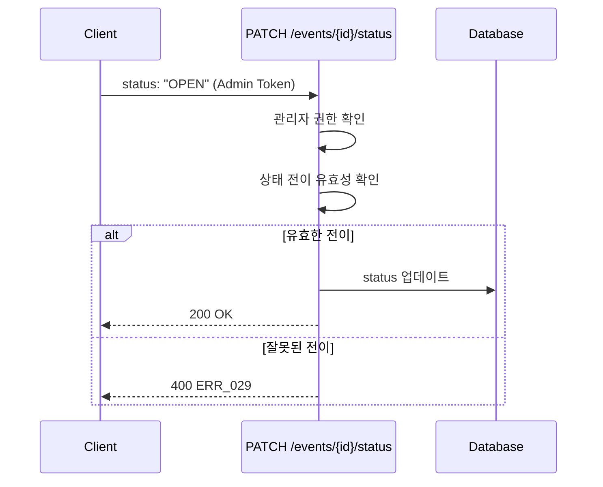
```mermaid
sequenceDiagram
    participant Client
    participant API as PATCH /events/{id}/status
    participant DB as Database

    Client->>API: status: "OPEN" (Admin Token)
    API->>API: 관리자 권한 확인
    API->>API: 상태 전이 유효성 확인
    alt 유효한 전이
        API->>DB: status 업데이트
        API-->>Client: 200 OK
    else 잘못된 전이
        API-->>Client: 400 ERR_029
    end
```

| ID | 시나리오 | API | 예상 결과 |
|----|----------|-----|-----------|
| E10 | READY→OPEN | PATCH /events/{id}/status | 200 |
| E11 | OPEN→CLOSED | PATCH /events/{id}/status | 200 |
| E12 | READY→SETTLED | PATCH /events/{id}/status | 400, `ERR_029` |
| E13 | 비관리자 요청 | PATCH /events/{id}/status | 403, `ERR_030` |
| E14 | 종료시각 지난 이벤트 OPEN | PATCH /events/{id}/status | 400, `ERR_032` |
| E15 | SETTLED 시 winner_option_id 누락 | PATCH /events/{id}/status | 400, `ERR_031` |

---

### 1-8. 베팅 생성 (`test_bets.py`)

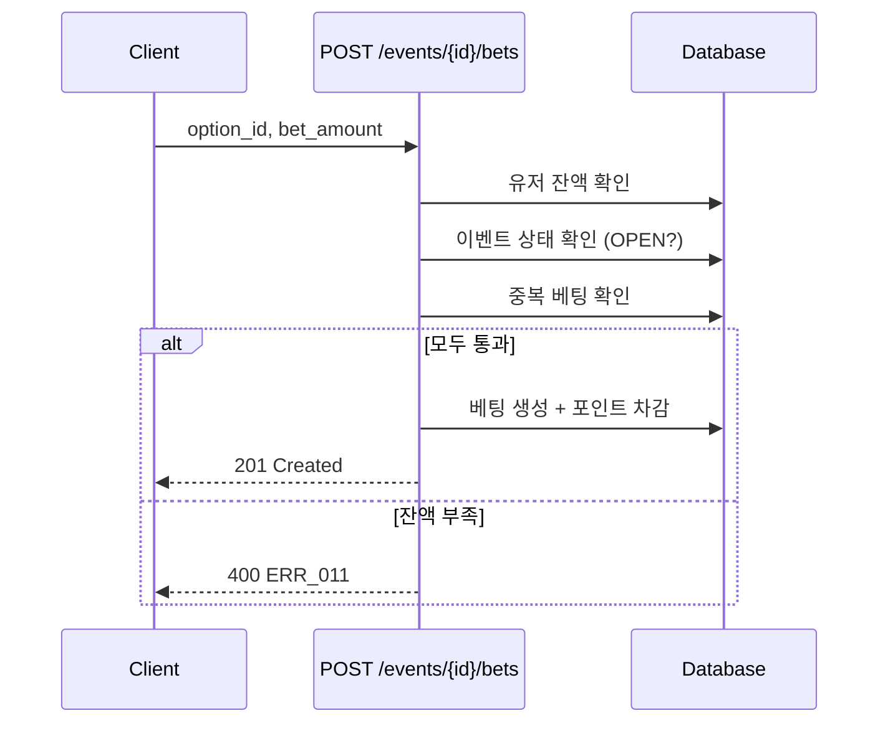
```mermaid
sequenceDiagram
    participant Client
    participant API as POST /events/{id}/bets
    participant DB as Database

    Client->>API: option_id, bet_amount
    API->>DB: 유저 잔액 확인
    API->>DB: 이벤트 상태 확인 (OPEN?)
    API->>DB: 중복 베팅 확인
    alt 모두 통과
        API->>DB: 베팅 생성 + 포인트 차감
        API-->>Client: 201 Created
    else 잔액 부족
        API-->>Client: 400 ERR_011
    end
```

| ID | 시나리오 | API | 예상 결과 |
|----|----------|-----|-----------|
| B01 | 베팅 성공 | POST /events/{id}/bets | 201 |
| B02 | 잔액 부족 | POST /events/{id}/bets | 400, `ERR_011` |
| B03 | 중복 베팅 | POST /events/{id}/bets | 409, `ERR_014` |
| B04 | OPEN 아님 | POST /events/{id}/bets | 409, `ERR_013` |
| B05 | 토큰 없음 | POST /events/{id}/bets | 401, `ERR_004` |
| B06 | 헤더 형식 오류 | POST /events/{id}/bets | 400, `ERR_003` |
| B07 | 만료된 토큰 | POST /events/{id}/bets | 401, `ERR_005` |

---

### 1-9. 내 베팅 조회 (`test_bets.py`)

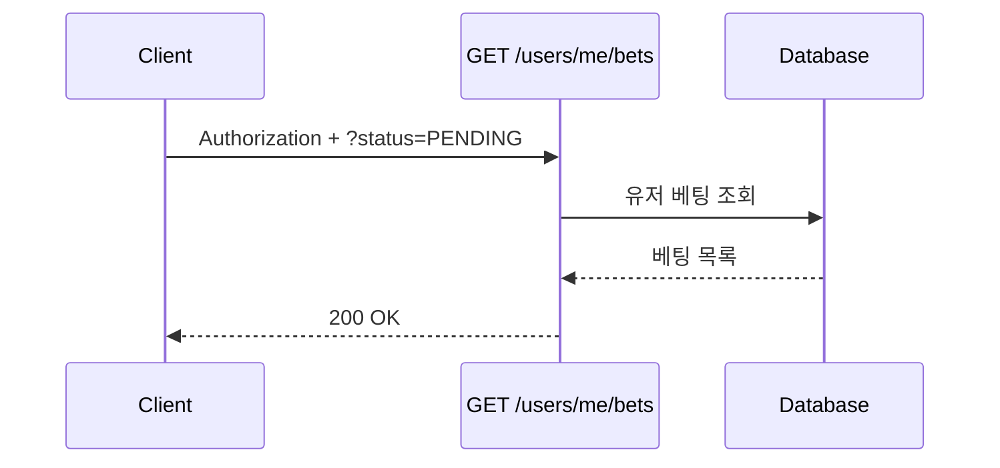
```mermaid
sequenceDiagram
    participant Client
    participant API as GET /users/me/bets
    participant DB as Database

    Client->>API: Authorization + ?status=PENDING
    API->>DB: 유저 베팅 조회
    DB-->>API: 베팅 목록
    API-->>Client: 200 OK
```

| ID | 시나리오 | API | 예상 결과 |
|----|----------|-----|-----------|
| B08 | 조회 성공 | GET /users/me/bets | 200, 베팅 배열 |
| B09 | 상태 필터 | GET /users/me/bets?status=PENDING | 200 |
| B10 | 토큰 없음 | GET /users/me/bets | 401, `ERR_004` |
| B11 | 헤더 형식 오류 | GET /users/me/bets | 400, `ERR_003` |

---

### 1-10. 이벤트 베팅 전체 조회 (`test_bets.py`)

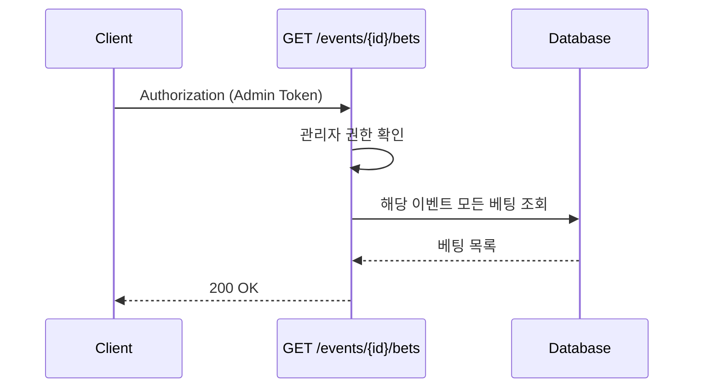
```mermaid
sequenceDiagram
    participant Client
    participant API as GET /events/{id}/bets
    participant DB as Database

    Client->>API: Authorization (Admin Token)
    API->>API: 관리자 권한 확인
    API->>DB: 해당 이벤트 모든 베팅 조회
    DB-->>API: 베팅 목록
    API-->>Client: 200 OK
```

| ID | 시나리오 | API | 예상 결과 |
|----|----------|-----|-----------|
| B12 | 조회 성공 | GET /events/{id}/bets | 200 |
| B13 | 비관리자 요청 | GET /events/{id}/bets | 403, `ERR_030` |
| B14 | 없는 이벤트 | GET /events/{id}/bets | 404, `ERR_009` |

---

### 1-11. 정산 (`test_settlement.py`)

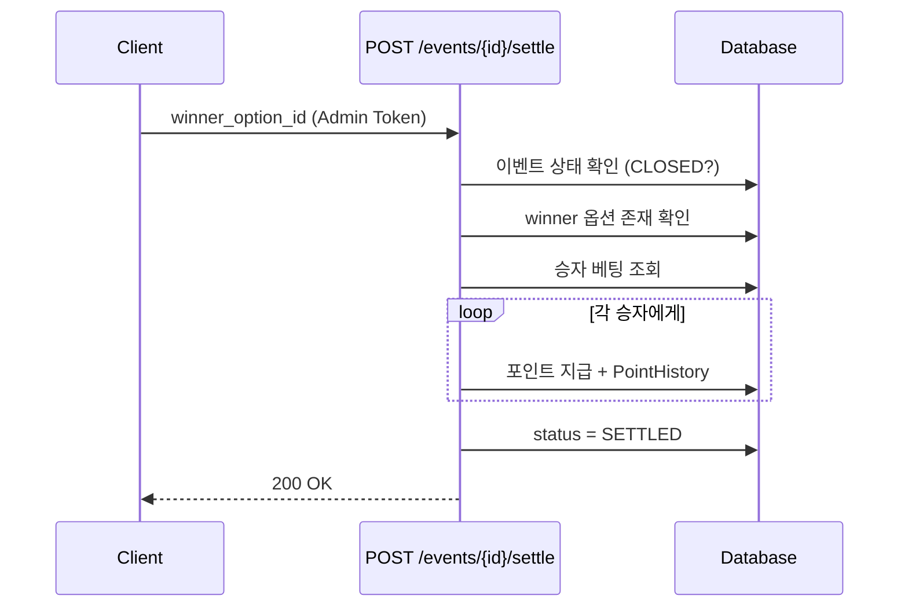
```mermaid
sequenceDiagram
    participant Client
    participant API as POST /events/{id}/settle
    participant DB as Database

    Client->>API: winner_option_id (Admin Token)
    API->>DB: 이벤트 상태 확인 (CLOSED?)
    API->>DB: winner 옵션 존재 확인
    API->>DB: 승자 베팅 조회
    loop 각 승자에게
        API->>DB: 포인트 지급 + PointHistory
    end
    API->>DB: status = SETTLED
    API-->>Client: 200 OK
```

| ID | 시나리오 | API | 예상 결과 |
|----|----------|-----|-----------|
| S01 | 정산 성공 | POST /events/{id}/settle | 200 |
| S02 | 없는 옵션 | POST /events/{id}/settle | 404, `ERR_033` |
| S03 | CLOSED 아님 | POST /events/{id}/settle | 400, `ERR_029` |

---

## 2. 통합 테스트 (Integration Tests)

> **정의**: API 2개 이상 순차 호출

### 2-1. 회원가입 → 인증 → 로그인

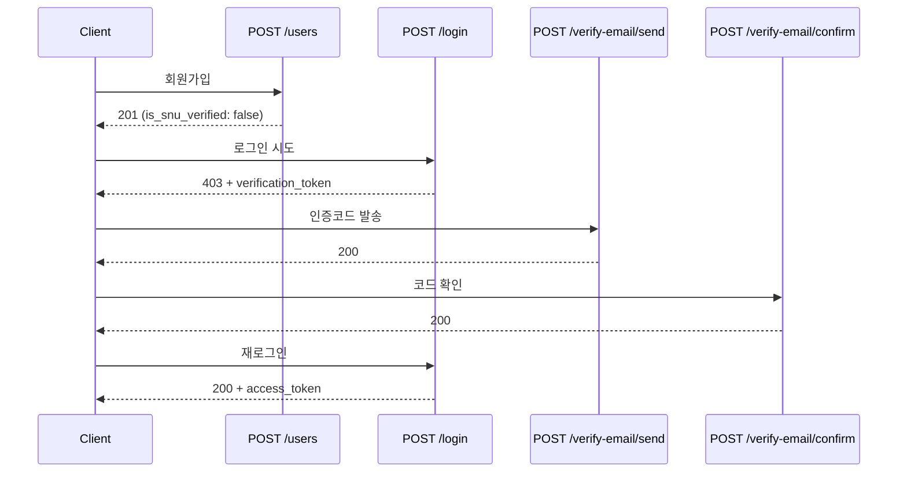
```mermaid
sequenceDiagram
    participant C as Client
    participant Signup as POST /users
    participant Login as POST /login
    participant Send as POST /verify-email/send
    participant Confirm as POST /verify-email/confirm

    C->>Signup: 회원가입
    Signup-->>C: 201 (is_snu_verified: false)

    C->>Login: 로그인 시도
    Login-->>C: 403 + verification_token

    C->>Send: 인증코드 발송
    Send-->>C: 200

    C->>Confirm: 코드 확인
    Confirm-->>C: 200

    C->>Login: 재로그인
    Login-->>C: 200 + access_token
```

---

### 2-2. 이벤트 → 베팅 → 정산

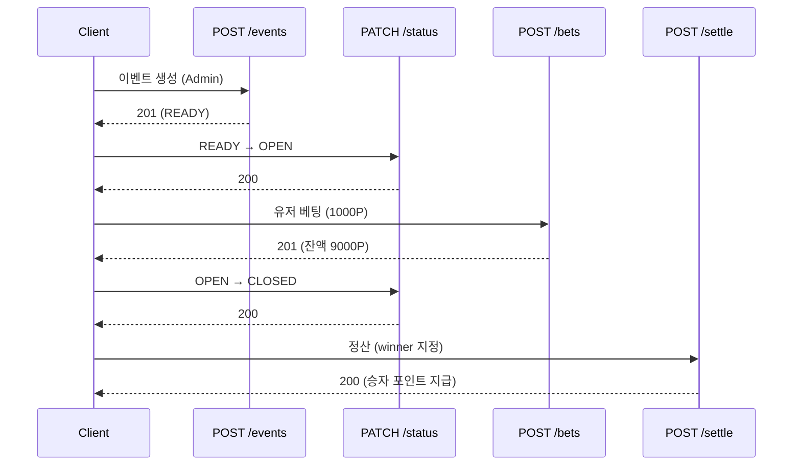
```mermaid
sequenceDiagram
    participant C as Client
    participant CreateAPI as POST /events
    participant StatusAPI as PATCH /status
    participant BetAPI as POST /bets
    participant SettleAPI as POST /settle

    C->>CreateAPI: 이벤트 생성 (Admin)
    CreateAPI-->>C: 201 (READY)

    C->>StatusAPI: READY → OPEN
    StatusAPI-->>C: 200

    C->>BetAPI: 유저 베팅 (1000P)
    BetAPI-->>C: 201 (잔액 9000P)

    C->>StatusAPI: OPEN → CLOSED
    StatusAPI-->>C: 200

    C->>SettleAPI: 정산 (winner 지정)
    SettleAPI-->>C: 200 (승자 포인트 지급)
```

---

### 2-3. 통합 테스트 케이스

#### I01. 회원가입 → 인증 → 로그인 (API 5개)

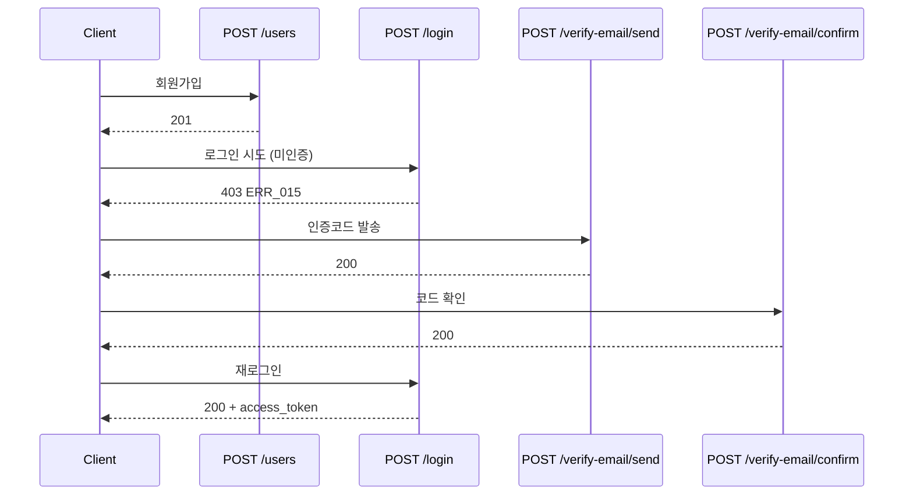
```mermaid
sequenceDiagram
    participant C as Client
    participant Signup as POST /users
    participant Login as POST /login
    participant Send as POST /verify-email/send
    participant Confirm as POST /verify-email/confirm

    C->>Signup: 회원가입
    Signup-->>C: 201

    C->>Login: 로그인 시도 (미인증)
    Login-->>C: 403 ERR_015

    C->>Send: 인증코드 발송
    Send-->>C: 200

    C->>Confirm: 코드 확인
    Confirm-->>C: 200

    C->>Login: 재로그인
    Login-->>C: 200 + access_token
```

**검증**: 인증 전 로그인 불가(403), 인증 후 로그인 가능(200)

---

#### I02. 이벤트 생성 → 오픈 → 베팅 (API 3개)

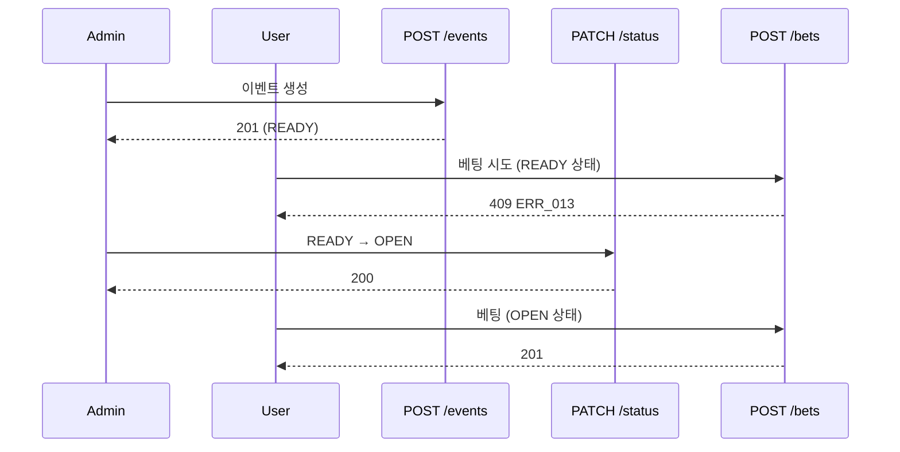
```mermaid
sequenceDiagram
    participant Admin
    participant User
    participant CreateAPI as POST /events
    participant StatusAPI as PATCH /status
    participant BetAPI as POST /bets

    Admin->>CreateAPI: 이벤트 생성
    CreateAPI-->>Admin: 201 (READY)

    User->>BetAPI: 베팅 시도 (READY 상태)
    BetAPI-->>User: 409 ERR_013

    Admin->>StatusAPI: READY → OPEN
    StatusAPI-->>Admin: 200

    User->>BetAPI: 베팅 (OPEN 상태)
    BetAPI-->>User: 201
```

**검증**: READY에서 베팅 불가(409), OPEN에서만 베팅 가능(201)

---

#### I03. 베팅 → 정산 → 포인트 확인 (API 3개)

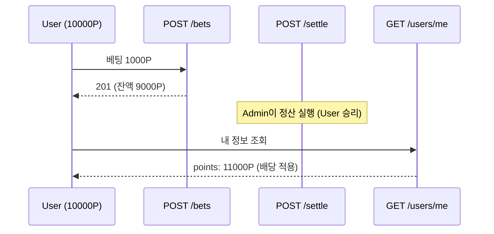
```mermaid
sequenceDiagram
    participant User as User (10000P)
    participant BetAPI as POST /bets
    participant SettleAPI as POST /settle
    participant GetUser as GET /users/me

    User->>BetAPI: 베팅 1000P
    BetAPI-->>User: 201 (잔액 9000P)

    Note over SettleAPI: Admin이 정산 실행 (User 승리)

    User->>GetUser: 내 정보 조회
    GetUser-->>User: points: 11000P (배당 적용)
```

**검증**: 베팅 후 잔액 감소, 승리 시 배당금 지급

---

#### I04. 중복 베팅 방지 (API 2개)

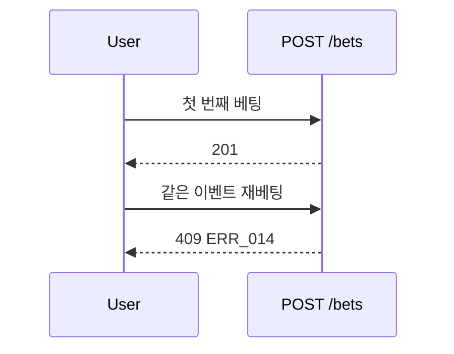
```mermaid
sequenceDiagram
    participant User
    participant BetAPI as POST /bets

    User->>BetAPI: 첫 번째 베팅
    BetAPI-->>User: 201

    User->>BetAPI: 같은 이벤트 재베팅
    BetAPI-->>User: 409 ERR_014
```

**검증**: 동일 이벤트 중복 베팅 시 409 반환

---

#### I05. 이벤트 취소 → 환불 (API 2개)

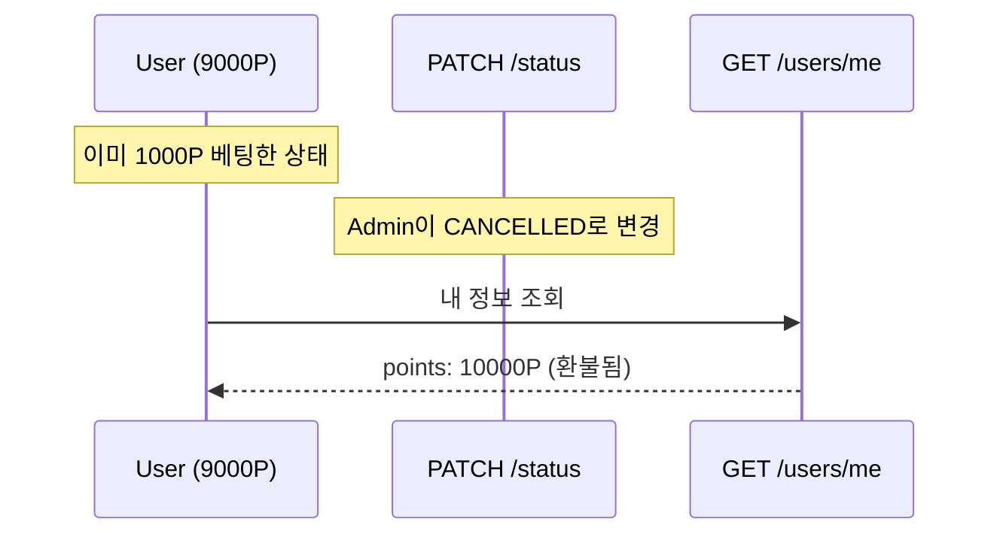
```mermaid
sequenceDiagram
    participant User as User (9000P)
    participant StatusAPI as PATCH /status
    participant GetUser as GET /users/me

    Note over User: 이미 1000P 베팅한 상태

    Note over StatusAPI: Admin이 CANCELLED로 변경

    User->>GetUser: 내 정보 조회
    GetUser-->>User: points: 10000P (환불됨)
```

**검증**: 이벤트 취소 시 베팅 포인트 전액 환불

---

| ID | 플로우 | 호출 API 수 | 검증 포인트 |
|----|--------|------------|------------|
| I01 | 회원가입→인증→로그인 | 5 | 인증 전 로그인 불가, 인증 후 가능 |
| I02 | 이벤트 생성→오픈→베팅 | 3 | OPEN에서만 베팅 가능 |
| I03 | 베팅→정산→포인트 확인 | 3 | 승자 포인트 증가 |
| I04 | 중복 베팅 방지 | 2 | 같은 이벤트 2회 베팅 → 409 |
| I05 | 이벤트 취소→환불 | 2 | CANCELLED 시 포인트 환불 |

---

## pytest 명령어

```bash
# 단일 테스트
pytest snu_toto/tests/test_users.py -v

# 통합 테스트
pytest snu_toto/tests/test_integration.py -v

# 전체
pytest snu_toto/tests/ -v
```

---

## ⚠️ 브랜치 충돌 현황 (팀원 공유용)

> **작성일**: 2026-01-11

### 현재 상황

`feat/db-schema` 브랜치를 `main`에 머지할 때 **7개 파일에서 충돌** 발생

### 충돌 파일 목록

| 파일 | 충돌 원인 |
|------|----------|
| `pyproject.toml` | 양쪽에서 다른 패키지 추가 (redis vs 기타) |
| `uv.lock` | 패키지 잠금 파일 불일치 |
| `snu_toto/alembic/env.py` | DB 마이그레이션 설정 차이 |
| `snu_toto/app/bets/models.py` | 모델 필드 정의 차이 |
| `snu_toto/app/core/config.py` | 환경 변수 설정 차이 |
| `snu_toto/app/events/models.py` | 이벤트 모델 관계 정의 차이 |
| `snu_toto/app/users/models.py` | 소셜 로그인 필드 추가 방식 차이 |

### 원인 분석

```
main
 └─ feat/init-app (머지됨)
     ├─ feat/db-schema (독자 개발 → models, alembic 수정)
     └─ feat/signup → feat/login (머지됨 → auth, users 수정)
```

**feat/login과 feat/db-schema가 동일 파일을 각자 다르게 수정**

### 임시 해결

- `feat/login` 브랜치 머지 완료
- `feat/db-schema`에서 **충돌 없는 파일만** 체크아웃:
  - `events/repositories.py`
  - `events/services.py`
  - `users/repositories.py`
  - `users/services.py`

### 필요한 작업

1. **models.py 통합**: feat/db-schema의 모델 정의를 현재 main에 수동 반영
2. **config.py 통합**: 환경 변수 설정 머지
3. **alembic 마이그레이션 재생성**: 통합된 모델로 새 마이그레이션 생성

### 현재 테스트 가능 API

| API | 상태 |
|-----|------|
| POST /api/users | ✅ |
| POST /api/auth/login | ✅ |
| POST /api/auth/verify-email/* | ✅ |
| GET /api/auth/google/callback | ✅ |
| GET /api/events | ✅ |
| POST /api/events | ❌ 라우터 미구현 |
| PATCH /api/events/{id}/status | ❌ 미구현 |
| POST /api/events/{id}/bets | ❌ 미구현 |
| POST /api/events/{id}/settle | ❌ 미구현 |

기본 포맷을 베팅(이벤트)이 단순 승/패로 하고 추후에 다양한 포맷을 지원
각 배팅 화면에서 댓글 기능 추가
베팅 자체를 개설하는 주체를 어느 정도 점수나 포인트를 넘은(인증된 사람?)등
포인트 활용 방안
최종 발표 때의 각 팀을 두고 베팅에서 최우수는 어느 팀이 될지 선정 (3팀))